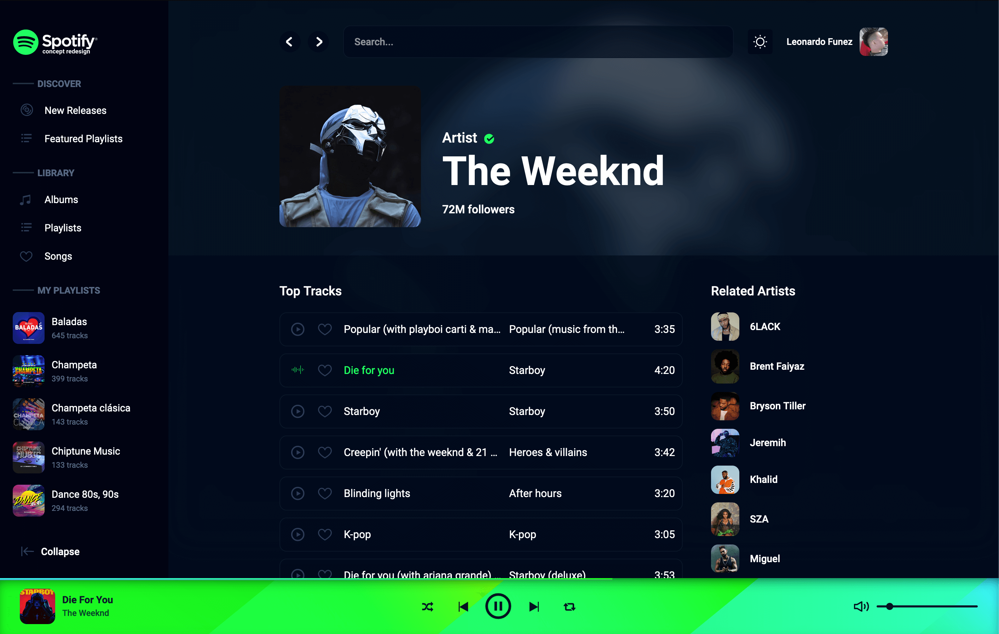
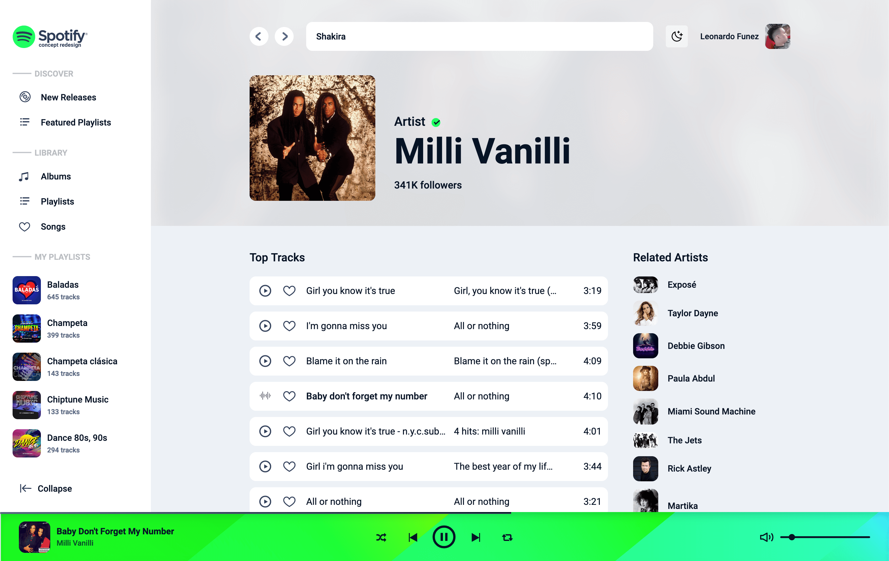

# Spotify 2.0 React — Concept Redesign

> A Spotify concept music app built with **React + Redux + Spotify Web API**. Browse new releases and featured playlists, search artists / albums / tracks / playlists, view rich artist / album / playlist / track details, manage your library (saved tracks, albums, playlists, artists), create playlists, and play 30-second track previews in a custom persistent player with dark concept UI.

Live demo: `https://spotify-v2-react.netlify.app` (see `public/index.html` `og:url`).


## Table of Contents

- [Features](#features)
- [Tech Stack / Frameworks](#tech-stack--frameworks)
- [Dependencies](#dependencies)
- [Getting Started](#getting-started)
- [Environment Files](#environment-files)
- [Available Scripts](#available-scripts)
- [Project Structure](#project-structure)
- [Routes](#routes)
- [Spotify API Coverage](#spotify-api-coverage)
- [State Management (Redux)](#state-management-redux)
- [Key Components](#key-components)
- [Auth, Player & Theming Notes](#auth-player--theming-notes)
- [Screenshots](#screenshots)

## Features

| Area | What it does |
| ---- | ------------ |
| Browse | New releases + featured playlists tabbed `Card` grids (`src/pages/Browse/Browse.js`) |
| Global search | `ProfileBar` search on `>2` chars: `search?q=&type=track,playlist,album,artist`, grouped `MiniCard` dropdown |
| Artist details | Header + top-tracks (`?country=es`) + albums + related artists (`src/pages/Details/Artist/Artist`) |
| Album details | Info + track list (`src/pages/Details/Album/Album`) |
| Playlist details | Header + text filter + `TrackList`, add/remove tracks, Play All (`src/pages/Details/Playlist/Playlist`) |
| Track / User details | Single track view, public user profile + playlists |
| Library | Saved tracks (`me/tracks`), albums (`me/albums`), playlists (`me/playlists` hydrated), artists via `localStorage spotifyReactArtists` + `artists/?ids=` |
| Playlist management | Create playlist modal in `MenuBar`, add/remove tracks, save/unsave tracks & albums (hearts) |
| Player | 30s `preview_url` playback with play/pause/prev/next, shuffle, repeat-one, progress, volume/mute |
| UX | Global `Loader`, per-playlist filter, responsive collapsible Library/Playlists menus, 404 page |

## Tech Stack / Frameworks

| Framework / Tool | Version | Role |
| ---------------- | ------- | ---- |
| React + ReactDOM | `^16.14.0` | UI framework, entry `src/index.js` (`Provider + Routes + globals.scss`) |
| Create React App / react-scripts | `3.4.3` | Toolchain (start/build/test/eject), `eslintConfig: react-app` |
| React Router DOM | `^5.2.0` | Routing (`BrowserRouter/Switch/Route` in `src/config/routes.js`) |
| Redux + React-Redux + Thunk + DevTools | `4.0.5 / 7.2.2 / 2.3.0 / 2.13.8` | Global store (`src/redux/store/store.js`) |
| Axios | `^0.20.0` | Spotify API client (`src/config/api.js`, baseURL `https://api.spotify.com/v1/`) |
| styled-components | `^5.2.0` | Primary styling (every component has `*.styles.js`) |
| node-sass + sass-loader | `^4.14.1 / ^10.0.3` | Global SCSS (`globals.scss`, `_colors.scss`, `_ligth.scss`, `_slider.scss`, `_checkbox.scss`) |
| prop-types | `^15.7.2` | Props validation |
| Testing Library | `jest-dom ^4.2.4 / react ^9.3.2 / user-event ^7.1.2` | CRA default tests |

> Note: `wouter@^2.5.1` is installed but unused (no import in `src/`).

## Dependencies

Full list from `package.json` (`spotify@0.1.0`, `private: true`):

| Package | Version | Purpose |
| ------- | ------- | ------- |
| `react` | `^16.14.0` | Core UI |
| `react-dom` | `^16.14.0` | DOM rendering |
| `react-router-dom` | `^5.2.0` | App routing |
| `redux` | `^4.0.5` | Store |
| `react-redux` | `^7.2.2` | Redux bindings + hooks |
| `redux-thunk` | `^2.3.0` | Async actions (`fetchUser`, playlists, etc.) |
| `redux-devtools-extension` | `^2.13.8` | DevTools |
| `axios` | `^0.20.0` | HTTP / Spotify API |
| `styled-components` | `^5.2.0` | Component styling |
| `node-sass` | `^4.14.1` | SCSS compilation |
| `sass-loader` | `^10.0.3` | Webpack Sass loader |
| `prop-types` | `^15.7.2` | Type checking |
| `react-scripts` | `3.4.3` | CRA scripts |
| `@testing-library/jest-dom` | `^4.2.4` | Test matchers |
| `@testing-library/react` | `^9.3.2` | Component tests |
| `@testing-library/user-event` | `^7.1.2` | Event simulation |
| `wouter` | `^2.5.1` | Unused — safe to remove |

Browserslist: prod `>0.2%, not dead, not op_mini all`; dev last Chrome/Firefox/Safari.

## Getting Started

Prerequisites: Node + Yarn, a Spotify Developer app (Client ID + whitelisted redirect URI).

```bash
yarn install

# create env files (see below)
yarn start   # http://localhost:3000 -> /login -> Authorize -> /
yarn build   # outputs to build/
yarn test    # CRA watch mode
```

Deploy: Netlify-ready. `public/_redirects` contains `/* /index.html 200` for SPA fallback. `public/index.html` title: `Spotify - React Concept Redesign`.

## Environment Files

Create two files in project root (`.gitignore` already ignores `.env.development/.production/.local/.test`):

1. `.env.development`

```bash
REACT_APP_SPOTIFY_CLIENT_ID=THISISMYCLIENTID123232
REACT_APP_SPOTIFY_CALLBACK_HOST=http://localhost:3000/login
```

2. `.env.production`

```bash
REACT_APP_SPOTIFY_CLIENT_ID=THISISMYCLIENTID123232
REACT_APP_SPOTIFY_CALLBACK_HOST=https://spotify-v2-react.netlify.app/login
```

| Variable | Required | Example |
| -------- | -------- | ------- |
| `REACT_APP_SPOTIFY_CLIENT_ID` | Yes | Spotify Dashboard → App Client ID |
| `REACT_APP_SPOTIFY_CALLBACK_HOST` | Yes | Must exactly match whitelisted redirect URI |

Auth uses Implicit Grant: `https://accounts.spotify.com/authorize/?client_id=$CLIENT_ID&response_type=token&redirect_uri=$CALLBACK&scope=$SCOPES`. Scopes (`src/pages/Login/Login.js` `appScopes`): `user-read-private`, `user-read-email`, `user-library-read/modify`, `user-follow-read/modify`, `playlist-read-private`, `playlist-modify-private/public`. Token callback `#access_token` → `localStorage.spotifyToken` → `fetchUser()=getMe()` → `/`.

## Available Scripts

| Script | Command | Description |
| ------ | ------- | ----------- |
| Start | `yarn start` | Dev mode at `http://localhost:3000`, reload + lint in console |
| Test | `yarn test` | Jest watch mode ([docs](https://facebook.github.io/create-react-app/docs/running-tests)) |
| Build | `yarn build` | Production bundle to `build/`, minified + hashed |
| Eject | `yarn eject` | One-way eject from CRA |

CRA docs: [Code Splitting](https://facebook.github.io/create-react-app/docs/code-splitting), [Bundle Size](https://facebook.github.io/create-react-app/docs/analyzing-the-bundle-size), [PWA](https://facebook.github.io/create-react-app/docs/making-a-progressive-web-app), [Advanced Config](https://facebook.github.io/create-react-app/docs/advanced-configuration), [Deployment](https://facebook.github.io/create-react-app/docs/deployment).

## Project Structure

```text
public/
  index.html              # title, og:title/url/image opimage.png
  _redirects              # /* /index.html 200 (Netlify SPA)
  manifest.json, favicon.ico, logo192/512.png, robots.txt
  opimage.png             # social preview
src/
  index.js                # Provider + Routes + globals.scss + init localStorage spotifyReactPlaylists/Artists
  config/
    api.js                # axios baseURL https://api.spotify.com/v1/ + Bearer localStorage.spotifyToken
    routes.js             # app shell (MenuBar/ProfileBar/Aside/Player/Loader) + all Routes
  helpers/
    breakpoint.js         # xxs375/xs480/sm768/md992/lg1200/xl1600 media helpers
    colors.js             # COLORS (dark:#051023, green:#00ff62, ...)
    dateFormatter.js / numFormatter.js / timeFormatter.js
    goToLogin.js          # window.location.href=/login on 401
  redux/
    store/store.js        # createStore + thunk + devtools
    reducers/             # index + playerReducers + playlistsReducer + userReducer + favoritesReducers + loadingReducer
    actions/              # types + userAction + playlistsAction + favoritesAction + playerActions + loadingAction
  components/
    Aside/ Card/ Globals/ Loader/ Main/ MenuBar/ Message/ MiniCard/
    Modal/ NotFound/ Player/ ProfileBar/ TopDetail/ Track/  # each *.js + *.styles.js
  pages/
    Login/Login.js        # SignIn/SignUp landing, token parsing
    Browse/Browse.js      # home tabs
    Details/Album, Artist, Playlist, Track, User/
    Library/MyAlbums, MyArtists, MyPlaylists, MyTracks/
    Error/Error.js        # NotFound type=page wrapper
  assets/
    scss/globals.scss + _colors.scss + _ligth.scss + _slider.scss + _checkbox.scss
    css/normalize.css
    img/bg/ favicon/ loaders/ logos/ player/ (~28 SVGs) icons/ (~40 SVGs)
docs/
  screenshots/
    screenshot-dark.png   # moved from public/screenshot_1.png
    screenshot-light.png  # moved from public/screenshot_2.png
```

## Routes

Defined in `src/config/routes.js` (`history.location.pathname !== /login` hides chrome):

| Path | Page |
| ---- | ---- |
| `/` | `Browse` (home) |
| `/login` | `Login` |
| `/track/:id` | Track details |
| `/album/:id` | Album details |
| `/artist/:id` | Artist details |
| `/playlist/:id` | Playlist details |
| `/user/:id` | User profile |
| `/favorites/tracks` | My tracks |
| `/favorites/albums` | My albums |
| `/favorites/playlists` | My playlists |
| `/favorites/artists` | My artists |
| `*` | Error / 404 |

## Spotify API Coverage

Base: `https://api.spotify.com/v1/` (`src/config/api.js`):

| Method | Endpoint |
| ------ | -------- |
| `getNewReleases` | `browse/new-releases` |
| `getFeaturedPlaylists` | `browse/featured-playlists` |
| `getPlaylist / getPlaylistImage / getPlaylistTracks` | `playlists/:id`, `/:id/images`, `/:id/tracks?offset=0&limit=100` |
| `getAlbumInfo / getAlbumTracks` | `albums/:id`, `albums/:id/tracks` |
| `getArtistInfo / getArtistTopTracks / getArtistAlbums / getArtistRelated / getArtists` | `artists/:id`, `/:id/top-tracks?country=es`, `/:id/albums`, `/:id/related-artists`, `artists/?ids=` |
| `getTrack` | `tracks/:id` |
| `getMe / getSavedTracks / getSavedAlbums / getMyPlaylists` | `me`, `me/tracks`, `me/albums`, `me/playlists` |
| `putTrackIntoPlaylist / deleteTrackFromPlaylist` | `POST playlists/:id/tracks?uris=...`, `DELETE .../tracks` |
| `putSavedAlbums / deleteSavedAlbums / putSavedTrack / deleteSavedTrack` | `PUT/DELETE me/albums?ids=`, `me/tracks?ids=` |
| `createPlaylist` | `POST users/:user_id/playlists` |
| `getUserInfo / getUserPlaylists` | `users/:id`, `users/:id/playlists` |
| `search` | `search?q=&type=track%2Cplaylist%2Calbum%2Cartist` |

Only tracks with non-null `preview_url` are playable.

## State Management (Redux)

| Slice | State | Key actions |
| ----- | ----- | ----------- |
| `user` | profile (`getMe`) | `fetchUser` |
| `playlists` | my playlists + hydrated details | `fetchPlaylists`, `createPlaylist` |
| `favorites` | saved tracks/albums/artists | `put/deleteSavedTrack/Albums` |
| `player` | `current_track`, `tracklist`, `tracklist_info`, `is_playing`, `shuffle`, `repeat` | `setTrackList`, `setTrackListInfo`, `setPlayerCurrentTrack` |
| `loading` | global spinner | `setLoading` |

`Track` rows dispatch player actions; `Player` uses singleton `Audio()` with `ontimeupdate→reset/next`, wrap-around next, random on shuffle, volume 0-100 + mute icons.

## Key Components

| Component | Responsibility |
| --------- | -------------- |
| `MenuBar` | Left nav (Discover/Library/My Playlists), create-playlist modal |
| `ProfileBar` | Top search + user chip |
| `Aside` | Right credit sidebar |
| `Player` | Bottom persistent player UI |
| `Track` | Row with play/pause/like/more-menu |
| `Card / MiniCard / TopDetail` | Grids, search results, detail headers |
| `Loader / Message / Modal / NotFound / Main / Globals` | Spinner, empty-filter message, generic modal, 404, layout + shared inputs/buttons |

## Auth, Player & Theming Notes

- Implicit Grant only, no refresh handling; token in plain `localStorage`.
- Player previews are ~30s MP3s (`track.preview_url`).
- Default theme is dark (`globals.scss: $dark`, `COLORS.dark #051023`). `src/assets/scss/_ligth.scss` (`.app--is-light`) exists but is currently dead code (no toggle found).

## Screenshots

### Dark mode — Artist detail (The Weeknd)

Artist header with 72M followers, Top Tracks list (`Popular`, `Die for you`, `Starboy`, `Creepin'`, `Blinding lights`), Related Artists sidebar (6LACK, Brent Faiyaz, Bryson Tiller…), left Discover/Library/My Playlists nav, and green bottom player bar playing `Die For You`.



### Light mode — Search / Artist detail (Milli Vanilli)

Light theme search for `Shakira` resolving to Milli Vanilli (341K followers), Top Tracks (`Girl you know it's true`, `I'm gonna miss you`, `Baby don't forget my number`…), Related Artists (Exposé, Taylor Dayne, Debbie Gibson…), same library sidebar and green player bar playing `Baby Don't Forget My Number`.


